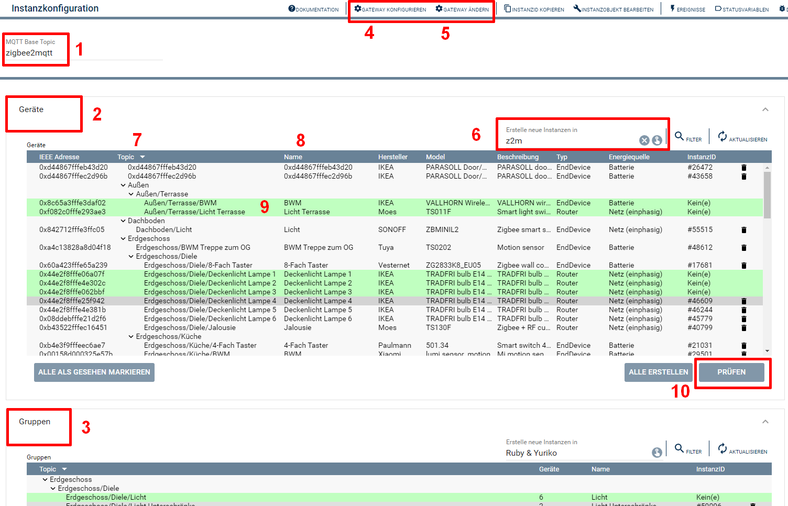
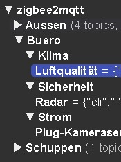

  

  

# Zigbee2MQTT-Konfigurator <!-- omit in toc -->
Mit dieser Instanz werden die Geräte und Gruppen aus Zigbee2MQTT ausgelesen und können in Symcon als Instanz angelegt werden.

## Inhaltsverzeichnis <!-- omit in toc -->
- [1. Voraussetzungen](#1-voraussetzungen)
- [2. Software-Installation](#2-software-installation)
- [3. Verwendung der Instanzen](#3-verwendung-der-instanzen)
- [4. Statusvariablen](#4-statusvariablen)
- [5. PHP-Funktionsreferenz](#5-php-funktionsreferenz)
- [6. Aktionen](#6-aktionen)
- [7. Anhang](#7-anhang)
  - [1. Changelog](#1-changelog)
  - [2. Spenden](#2-spenden)
  - [3. Lizenz](#3-lizenz)

## 1. Voraussetzungen

* mindestens IPS Version 7.0
* MQTT-Broker (interner MQTT-Server von Symcon oder externer z.B. Mosquitto)
* installiertes und lauffähiges [zigbee2mqtt](https://www.zigbee2mqtt.io) 
  
## 2. Software-Installation

* Dieses Modul ist Bestandteil der [Zigbee2MQTT-Library](../README.md#3-installation).  

## 3. Verwendung der Instanzen

Wird beim ersten öffnen der Instanz eine Fehlermeldung angezeigt, dass keine Geräte gefunden wurden, so ist die benötigte [Extension in Zigbee2MQTT](#33-installation-der-ip-symcon-extension-in-zigbee2mqtt) nicht installiert.  
Über den Button `Bridge-Instanz erstellen` kann eine fehlende Instanz erstellt werden, welche automatisch die Erweiterung installiert.  
Anschließend wird der Konfigurator neu geladen.  
  

Ist die Erweiterung verfügbar, so werden alle in Z2M angelernten Geräte und alle dazugehörigen Instanzen aufgelistet.  
  

| Nummer | Name                           | Beschreibung                                                                                                                                                                                                                                                                                                                                                                                                                                                       |
| :----: | ------------------------------ | ------------------------------------------------------------------------------------------------------------------------------------------------------------------------------------------------------------------------------------------------------------------------------------------------------------------------------------------------------------------------------------------------------------------------------------------------------------------ |
| **1**  | **MQTT Base Topic**            | Das Topic unter welchem Zigbee2MQTT erreichbar ist. Werden mehrere Zigbee2MQTT Installationen am gleichen MQTT Broker (Server) betrieben, so muss pro Installation ein neues Base Topic genutzt werden.                                                                                                                                                                                                                                                            |
| **2**  | **Geräte**                     | Zeigt die Liste aller Geräte welche in Z2M angelernt sind. Ebenso wie alle [Zigbee2MQTT-Geräte](../Device/README.md) Instanzen in Symcon mit dem gleichen Base Topic bzw. mit der gleichen IEEE Adresse.                                                                                                                                                                                                                                                           |
| **3**  | **Gruppen**                    | Zeigt die Liste aller Gruppen welche in Z2M angelegt wurden. Ebenso wie alle [Zigbee2MQTT-Gruppen](../Group/README.md) Instanzen in Symcon mit dem gleichen Base Topic.                                                                                                                                                                                                                                                                                            |
| **4**  | **Gateway konfigurieren**      | Unter diesem Punkt kann der verbundene MQTT-Splitter (Client oder Server) aufgerufen werden.                                                                                                                                                                                                                                                                                                                                                                       |
| **5**  | **Gateway ändern**             | Hier werden alle in Symcon vorhandenen MQTT-Splitter (Client und Server) angezeigt. Und durch wählen eines Eintrag wird die Verbindung zu einem anderen Splitter ausgewählt.                                                                                                                                                                                                                                                                                    |
| **6**  | **Erstelle neue Instanten in** | Hier kann eine Startkategorie aus dem Objektbaum ausgewählt werden, unter welcher neue Instanzen angelegt werden.                                                                                                                                                                                                                                                                                                                                                  |
| **7**  | **Topic**                      | Gibt den in Zigbee2MQTT (Z2M) angegebenen Namen an.   **WICHTIG: MQTT unterstützt eine Ordnerstruktur bei Topics. Hierzu wird ein Slashes (`/`) in dem Namen bei Z2M benutzt um die einzelnen Ebenen zu trennen. Zum Beispiel: `Etage/Raum/Sparte/Gerätename`).**  Der Konfigurator zeigt diese Ordnerstruktur an und erstellt Instanzen in entsprechenden Kategorien unterhalb der in **6** angegeben Kategorie. Wichtig: In Z2M darf der Gerätename (das spätere Topic) NICHT mit einem "/" oder einer einzeln stehenden Ziffer (z.B. `Etage/Raum/Sparte/Gerätename/` oder `Etage/Raum/Sparte/Gerätename/5` enden. |
| **8**  | **Name**                       | Als Name wird der letzte Teil des Topics genutzt, oder bei vorhandenen Instanzen wir deren Name angezeigt.                                                                                                                                                                                                                                                                                                                                                         |
| **9**  | **Zeileneintrag**              | Jede Zeile stellt entweder ein Ordner der Topic Struktur oder ein Gerät dar. Die verschiedenen Farben und Bedeutungen entsprechen dem [Symcon Standard aller Konfiguratoren](https://www.symcon.de/de/service/dokumentation/grundlagen/instanzen/konfiguratoren/)                                                                                                                                                                                                  |
| **10** | **Erstellen/Prüfen**           | Je nach ausgewählter Zeile ist es hier möglich einzelne Instanzen zu erstellen, oder deren Konfiguration zu überprüfen.                                                                                                                                                                                                                                                                                                                                            |

Weitere allgemeine Hinweise zu Konfiguratoren sind der [Symcon Dokumentation](https://www.symcon.de/de/service/dokumentation/grundlagen/instanzen/konfiguratoren/) zu entnehmen.

## 4. Statusvariablen

Dieses Modul erzeugt keine Statusvariablen.  

## 5. PHP-Funktionsreferenz

Keine Funktionen verfügbar.  

## 6. Aktionen

Keine Aktionen verfügbar.

## 7. Anhang

### 1. Changelog

[Changelog der Library](../README.md#5-changelog)

### 2. Spenden

Dieses Modul ist für die nicht kommerzielle Nutzung kostenlos, Schenkungen als Unterstützung für den Autor werden hier akzeptiert:

 <a href="https://www.amazon.de/hz/wishlist/ls/3JVWED9SZMDPK?ref_=wl_share" target="_blank">Amazon Wunschzettel</a>

### 3. Lizenz

[CC BY-NC-SA 4.0](https://creativecommons.org/licenses/by-nc-sa/4.0/)
